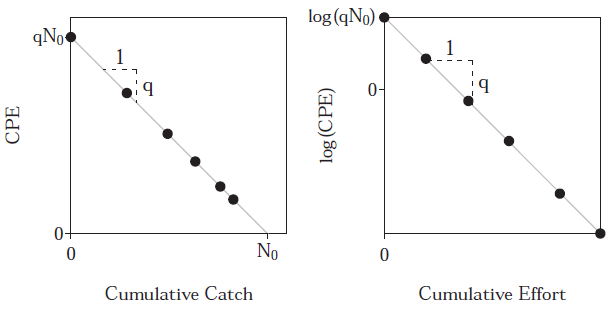

```{r setup, include=FALSE}
# setwd('WDAFS Workshop/Abundance Estimation Workshop')

knitr::opts_chunk$set(echo = FALSE)
library(FSA)
# library(Rcapture)
library(dplyr)
```

## Introductory Fisheries Analyses in R - Derek Ogle


## Introductory Fisheries Analyses in R - Derek Ogle

Available at: <br>
- <a href="https://www.crcpress.com/Introductory-Fisheries-Analyses-with-R/Ogle/p/book/9781482235203"> CRC Press </a> <br>
- <a href="https://www.amazon.com/Introductory-Fisheries-Analyses-Chapman-Hall/dp/148223520X/ref=sr_1_1?ie=UTF8&qid=1492481753&sr=8-1&keywords=introductory+fisheries+analyses+with+r"> Amazon </a> <br>

Chapter 9: Abundance from Capture-Recapture Data <br>
Chapter 10: Abundance from Depletion Data <br>

Additional Resources: <br>
- <a href="http://derekogle.com/IFAR/"> http://derekogle.com/IFAR/ </a> <br>
- <a href="http://derekogle.com/fishR/"> http://derekogle.com/fishR/ </a> <br>

## Outline

1. Summarize capture histories
2. Simple Petersen mark-recapture
3. Petersen mark-recap for 'groups' (e.g., by size class)
4. Schnabel or Schumacher-Eschmeyer mark-recapture
5. Jolly-Seber mark-recapture
6. Simple K-pass (e.g., 3-pass) removal estimates
7. Lots of K-pass removal estimates 'at once'
8. Depletion (Leslie and DeLury) methods (time permitting)

## Install and Load Packages

```{r packages, eval = FALSE, echo = TRUE}
install.packages(c('FSA','FSAdata','Rcapture','dplyr')) # Download
library(FSA) # Install/load
library(FSAdata)
library(Rcapture)
library(dplyr)
```
Ogle, D.H. 2017. FSA: Fisheries Stock Analysis. R package version 0.8.12. <br>

Louis-Paul Rivest and Sophie Baillargeon (2014). Rcapture: Loglinear Models for Capture-Recapture Experiments. R package version 1.4-2. https://CRAN.R-project.org/package=Rcapture <br>

Hadley Wickham and Romain Francois (2016). dplyr: A Grammar of Data Manipulation. R package version 0.5.0. https://CRAN.R-project.org/package=dplyr <br>

# ABUNDANCE FROM CAPTURE-RECAPTURE DATA

# CAPTURE HISTORIES

## CAPTURE HISTORIES

Fish Marking <br>

1. Batch mark (e.g., fin clip) - individual fish CANNOT be specifically identified <br>
2. Individual mark (e.g., Floy, CWT, PIT) - individual fish CAN be specifically identified <br>

For *batch marking*, the numbers of marked (i.e., previously captured) and unmarked fish in each sample are recorded. For *individual marking*, specific tag numbers for fish captured in each sampling event are recorded. <br>

## Individual marking

For individually marked fish, capture/recapture information is recorded in *capture history* format (Pollock et al. 1990) <br>

- "1" = Fish was captured in given sampling event
- "0" = Fish was **not** captured in given sampling event

Two formats: <br>
1. Individual fish <br>
2. Frequency <br>

## Individual Fish Format
Fish 1 was captured (and marked) in the first sample, not captured in the second sample, recaptured in the third sample, and not captured in either the fourth or fifth samples. In contrast, Fish 5 was captured (and marked) only in the fifth sample.

 Fish   Event1   Event2   Event3   Event4   Event5
------ -------- -------- -------- -------- --------
  1        1        0        1        0        0
  2        0        1        0        1        0
  3        0        1        0        1        0
  4        1        0        1        0        0
  5        0        0        0        0        1
------ -------- -------- -------- -------- --------

## Frequency Format
Each row represents a unique capture history with the frequency of fish with that capture history in a unique column. Thus, the number of rows corresponds to the number of unique capture histories and the sum of the frequency column is the total number of fish captured in all sampling events.

 Frequency   Event1   Event2   Event3   Event4   Event5   
----------- -------- -------- -------- -------- --------
     2         1         0        1        0        0
     2         0         1        0        1        0
     1         0         0        0        0        1
----------- -------- -------- -------- -------- --------

*Same data as previous slide.

## EXERCISE - Capture Histories

Zehfuss et al. (1999) captured Gulf Sturgeon from below Jim Woodruff Dam on the Apalachicola River (Florida) on 13 occasions during the summer 1985. Fish >45cm were uniquely tagged. These data (Zehfussetal_1985.txt) were recorded with captures histories in a compact form (stored as one variable).

```{r sturgeon, echo = TRUE}
gs.M <- read.table('data/Zehfussetal_1985.txt', header = TRUE, 
                   colClasses = c('character', 'character'))
headtail(gs.M) 
```

## `capHistConvert()`

`capHistConvert()`: Function in FSA package to convert between several simple capture history formats. 
```{r capHistConvertHelp, eval = FALSE, echo = TRUE}
# Access Full Help Documentation
?capHistConvert
```
```{r capHistConvert, eval = TRUE, echo = TRUE}
gs.I <- capHistConvert(df = gs.M, in.type = 'MARK', freq = 'freq', 
                       out.type = 'individual', include.id = TRUE, 
                       var.lbls.pre = 'e')
```

## MARK -> Individual Fish Format
```{r capHistConvert2, eval = FALSE, echo = TRUE}
gs.I <- capHistConvert(df = gs.M, in.type = 'MARK', freq = 'freq', 
                       out.type = 'individual', include.id = TRUE, 
                       var.lbls.pre = 'e')
```
Arguments: <br>
- `df`: The source data.frame in a supported format <br>
- `in.type`: Format of the source data <br>
- `out.type`: Desired format to be returned <br>
- `freq`: Depending on format of `in.type`, name of variable containing frequencies <br>
- `include.id`: Include fish identifiers in the resultant df? <br>
- `var.lbls.pre`: Prefix for variable labels <br>

## Individual Fish Format
```{r, eval = FALSE, echo = TRUE}
gs.I <- capHistConvert(df = gs.M, in.type = 'MARK', freq = 'freq', 
                       out.type = 'individual', include.id = TRUE, 
                       var.lbls.pre = 'e')
```
```{r gs.I, eval = TRUE, echo = TRUE}
headtail(gs.I)
```

## Summarize CH Data

Capture history data must be summarized to estimate population parameters with capture-recapture methods. <br>

`capHistSum()`: FSA function to generate several useful CH summaries.
```{r capHistSum, eval = TRUE, echo = TRUE}
gs.ch <- capHistSum(gs.I, cols2use = -1)
```
```{r capHistSum2, eval = FALSE, echo = TRUE}
gs.ch <- capHistSum(gs.I, cols2use = 2:14)
```
Arguments: <br>
- `df`: data.frame of ONLY the ch data in individual fish format <br>
- `cols2use`: Which columns represent ch data? <br>

## Summarize CH Data
```{r caphist, eval = TRUE, echo = TRUE}
gs.ch$caphist[1:10] # Only first 10 displayed
```
Eight fish have the '0000000000010' capture history. <br>

The remaining four objects in the `capHistSum()` object `$sum`, `$methodB.top`, `$methodB.bot`, and `$m.array` are specific to methods and will be discussed later. <br>

# SIMPLE PETERSEN MARK-RECAPTURE

## Simple Peterson (Closed Population, Single Recapture)

Under strict assumption, the ratio of ${M}$ to total population size ${N}$ is equal to the ratio of ${m}$ to ${n}$. The equality of ratios is algebraically solved for ${N}$ to produce the well-known Petersen equation. The simple Peterson equation is biased for small samples. However, Chapman (1951) showed
$$
\hat{N} = \frac{(M + 1) (n + 1)}{(m + 1)} - 1
$$
is an unbiased estimator of ${N}$ when ${(M+n)}$ is ${>=}$ ${N}$, or is nearly unbiased when ${m}$ is ${>}$ 7 (Krebs 1999).

## Simple Petersen
$$
\hat{N} = \frac{(M + 1) (n + 1)}{(m + 1)} - 1 \tag{9.1}
$$
$\hat{N}$ = Population Size Estimate <br>
${M}$ = Number of Fish Marked and Returned in Initial Event <br>
${n}$ = Number of Fish Collected in Recapture Event <br>
${m}$ = Number of ${n}$ that are Marked <br>

Closed Population, Single Recapture

## Simple Petersen - Confidence Intervals

In most situations, confidence intervals for ${N}$ can be constructed from hypergeometric distribution. However, confidence intervals for ${N}$ can be approximated from other distributions depending on the data (Seber 2002). <br>

- Binomial Distribution: If more than 10% of fish in the second sample are recaptured (i.e., $\frac{m}{n}$ > 0.10) <br>
- Poisson Distribution: If ${m}$ < 50 <br>
- Normal Distribution: If ${m}$ > 50 <br>

## `mrClosed()`

Petersen and related modification to estimate ${N}$ are conducted using the `mrClosed()` function in FSA package. <br>

`mrClosed()` requires ${M}$, ${n}$, and ${m}$ as first three arguments (in that order). <br>

Default estimator is original Petersen estimator, but the Chapman modification is used by including `method = 'Chapman'`. <br>

$\hat{N}$ is extracted from `mrClosed()` object with `summary()`. An estimated standard error (SE) for $\hat{N}$ is provided by including `incl.SE = TRUE` in `summary()`. 

## `mrClosed()` Confidence Intervals

A CI for $\hat{N}$ is extracted from `mrClosed()` object using `confint()`. By default, the distribution used to construct the Ci follows Seber's guidelines described previously. <br>

However, a specific distribution may be selected by setting `type =` as `'hypergeometric'`, `'binomial'`, `'Poisson'`, or `'normal'`. <br>

Which distribution was used is not displayed unless `verbose = TRUE` is included in `confint()`

## EXAMPLE 1 - Petersen Estimate

Wisconsin DNR biologists marked 2555 walleye >304 mm from Sand Lake one night. They returned the following night and captured 274 walleye >304 mm. Of those, 92 were recaptured from the previous night's efforts. 

```{r mrClosed, eval = TRUE, echo = TRUE}
sl1 <- mrClosed(M = 2555, n = 274, m = 92, method = 'Chapman')
summary(sl1, incl.SE = TRUE)
confint(sl1, verbose = TRUE)
```

## EXAMPLE 2 - Petersen Estimate

If capture histories (rather than summarized counts) are recorded for two events, then they can be summarized with `capHistSum()`. The resulting object can then be submitted as the first argument to `mrClosed()` which will automatically extract the values for ${M}$, ${n}$, and ${m}$. <br>

Using just the 5th and 6th sample event for Gulf Sturgeon example.

```{r gsExample, eval = TRUE, echo = TRUE}
gs.ch56 <- capHistSum(gs.I, cols2use = 5:6)
gs.mr56 <- mrClosed(gs.ch56, method = 'Chapman')
cbind(summary(gs.mr56, incl.SE=TRUE), confint(gs.mr56))
```

## Ugly River Brown Trout

Young and Hayes (2001) described a study where Brown Trout (Salmo trutta) in several rivers were captured by experienced fly fishers, tagged at the base of the dorsal fin with a colored dart tag, and then observed by divers drifting through the sample area two days later. In this study, 43 trout were marked, 123 fish were observed by the divers, and 16 fish observed by the divers were tagged. <br>

1. Assign one of these symbols (${N, M, n, m}$) to each of the numerical results from this study. <br>
2. Construct a population estimate, with 95% confidence interval, for the Brown Trout in this section of the Ugly River. Carefully interpret the results. <br>
3. Which method did you use to construct the confidence interval? Explain why you chose that method? <br>

## Niagara Springs Rainbow Trout

Warren et al. (2004) examined the population of Rainbow Trout (Oncorhynchus mykiss) in the Upper Niagara Springs Pond in 2000. Fish were captured at two times by using an electrofishing unit attached to a driftboat. The capture history of all fish examined in the two samples that were 100 mm and longer is in `RBTroutUNSP` in the `FSAdata` package. Analyze these capture histories to answer the following questions. <br>

1. Create a summary of the capture histories. <br>
2. From your capture history summary assign values to each of ${M, n, m}$. <br>
3. Construct an appropriate population estimate, with 95% confidence interval, for Upper Niagra Springs Pond Rainbow Trout in 2000. Carefully interpret the results. <br>
4. Which method did you use to construct the confidence interval? Explain why you chose that method. <br>

# PETERSEN MARK-RECAP FOR GROUPS

## Separate Groups

Fish may be separated into groups to control for different catchabilities among groups (Pine et al. 2003) or to provide more detailed results. <br>

To do this, the ${M, n, m}$ values for each group are entered into separate vectors, which are then the first three arguments of `mrClosed()`. <br>

A vector of labels for each group may be given to `labels =`. <br>

In addition to providing an abundance estimate for each group, separate estimates are also combined to provide an estimate of total abundance. <br>

## EXAMPLE - Separate Groups

Sand Lake walleye longer than 304 mm were separated into two groups: <br>
- < 381 mm <br>
- > 381 mm <br>

```{r sandLakeWalleye, eval = TRUE, echo = TRUE}
group <- c('305-380', '381+')
M <- c(1929, 626)
n <- c( 222, 52)
m <- c(  77, 15)
sl2 <- mrClosed(M, n, m, label = group, method = 'Chapman')
cbind(summary(sl2, incl.SE = TRUE), confint(sl2, incl.all = TRUE))
```

## ASSUMPTIONS

Valid application of the Petersen and related modifications depends on five assumptions being reasonably met (Seber 2002; Hayes et al. 2007; Pine et al. 2012): <br>

1. The population is physically (i.e., no immigration or emigration) and demographically (i.e., no recruitment or mortality) closed.
2. Marks or tags are neight lost nor missed.
3. Marked fish returned to the population mix randomly with unmarked fish.
4. All fish within a sample have an equal probability of capture.
5. Fish behavior or vulnerability does not change after being marked.

## ASSUMPTIONS

- Folks attempt to meet first assumption with very short period between the first and second samples. <br>
- Seber (2002) outlined chi-square test to detect recruitment between two samples (requires length categories be recorded). <br>
- Tag loss assessed by double-tagging fish with observed proportional tag loss used to adjust final abundance estimate (Pine et al. 2003). <br>

## ASSUMPTIONS (CONT.)

- Equal probability of capture is difficult to ensure because of selectivity of most fishing gears. Assumption may be grossly met by using several different gears to capture fish or stratifying by length (or other grouping) shown previously (Pine et al. 2003). <br>
- Differential capture probability over time, due to behavioral changes in/among fish can be assessed with more than one recapture event and using more sophisticated models (see Log-Linear Model Methods; Chapter 9).

# Closed Population - Multiple Recaptures

## Multiple recapture events

- All newly and previously marked fish are returned to population before next sampling event

For sample event $i$:

- $n_i$: number of captured fish
- $m_i$: previously marked fish
- $R_i$: marked fish returned to population
- $M_i$: all marked fish existing in population prior to sampling event $i$

$$
M_i = \sum^{i-1}_{j = 1} (R_j - m_j)
$$

## Shnabel Estimator

$$
\hat{N} = \frac{\sum^{k}_{i = 1} n_iM_i}{\left( \sum^k_{i=1} m_i \right) + 1} \tag{9.2}
$$
- Weighted average of Petersen estimates at each recapture event

## Schumacher-Eschmeyer

$$
\hat{N} = \frac{\sum^{k}_{i = 1} n_iM_i^2}{ \sum^k_{i=1} m_iM_i} \tag{9.3}
$$
- Based on based on minimizing the weighted sum-of-squares between the proportion of marked animals in a sample (i.e., $\frac{m_i}{n_i} ) and the unknown proportion of marked animals in the population. 

## Example - Gulf Sturgeon

```{r gulf_sturgeon_data, echo = T, eval = T}
headtail(gs.ch$sum) # only first & last 3 rows (events) shown
```

## Example - Gulf Sturgeon

```{r gulf_sturgeon_est, echo = T, eval = F}
gs.mr1 <- mrClosed(gs.ch, method = "Schnabel")
cbind(summary(gs.mr1), confint(gs.mr1, verbose=TRUE))
```

```{r gulf_sturgeon_fixed, echo = F, eval = T}
gs.mr1 <- mrClosed(gs.ch, method = "Schnabel")

gs.ci.mat = poiCI(gs.mr1$sum.m)[1,]
names(gs.ci.mat) = rev(names(gs.ci.mat))
cat('The Poisson distribution was used')
c('N' = summary(gs.mr1), round(sum(gs.mr1$n * gs.mr1$M) / (rev(gs.ci.mat) + 1)))
```


```{r gulf_sturgeon_est2, echo = T, eval = T}
gs.mr1 <- mrClosed(gs.ch, method = "SchumacherEschmeyer")
cbind(summary(gs.mr1), confint(gs.mr1, verbose=TRUE))
```

## Multiple recapture assumptions

Same as single recapture assumptions:

1. The population is physically (i.e., no immigration or emigration) and demographically (i.e., no recruitment or mortality) closed.
2. Marks or tags are neight lost nor missed.
3. Marked fish returned to the population mix randomly with unmarked fish.
4. All fish within a sample have an equal probability of capture.
5. Fish behavior or vulnerability does not change after being marked.

## EXERCISE - Tan Riffleshell {.smaller}

[Rogers (1999)](./lit/Rogers 1999.pdf) studied the endangered freshwater mussel Tan Riffleshell ($Epioblasma$ $florentina$ $walkeri$) in Indian Creek, Virginia. Part of the study included a detailed analysis of the population dynamics of mussels in a 100 m stretch of stream. In this stream, mussels were captured by teams on snorkelers on six occassions (June 1996; August 1996; June 1997; October 1998; May 1999; and June 1999). Mussels were tagged by attaching a numbered tag to the left valve of the mussel. The number of mussels captured, the number of marked mussels observed, and the number of tagged mussels returned to the population were recorded for each sample time. These data are in `Riffleshell` in the `FSAdata` package. Use this information to answer the following questions.

1. Estimate the number, with 95% confidence interval, of Tan Riffleshell mussels in the population at the beginning of the study. Carefully interpret the result.
2. Comment on the validity of the assumptions for the model you used to estimate the size of the population.

## EXERCISE - Wisconsin YOY Walleye {.smaller}

Mraz (1968) examined the population dynamics of young-of-the-year (YOY) walleye ($Sander$ $vitreus$) in Pine Lake, an inland lake in Wisconsin. In fall 1962, YOY walleye were captured, marked, and returned to the lake on five sampling dates. On each date, the number of fish caught, the number of caught fish that were previously marked, and the number of marked fish returned to the lake were recorded. The results from these sampling efforts are generated by the following data.frame

```{r, eval = F, echo = T}
walleye <- data.frame(sample = c(1,2,3,4,5), 
                      caught = c(321,412,178,415,367),
                      recaptured = c(NA,45,55,93,113), 
                      returned = c(321,412,178,415,NA))
```

1. Estimate the initial population size, with 95% confidence interval, of YOY Walleye in Pine Lake. Carefully interpret the result.
2. Comment on the validity of the assumptions for the model you used to estimate the size of the population.

# JOLLY-SEBER MARK-RECAPTURE

## Jolly-Seber (Open Populations)

Methods described previously only applicable to closed populations (recruitment, mortality, immigration, emigration).

Assumption usually maintained by having sampling events with little time between them.

However, many realistic situations occur with samples that span periods of time where assumption of closed population is not reasonable assured.

## Jolly-Seber (Open Populations)

Jolly-Seber method (Jolly 1965; Seber 1965) is used to estimate abundance at the time of sample event ${i}$ (${N_i}$) when three or more samples of marked fish have been collected from an open population.

## Jolly-Seber - sampling

Sampling scheme for Jolly-Seber study is similar to that described for Schnabel and Schumacher-Eschmeyer methods.

Multiple sampling events are used and previously unmarked fish are marked and returned to the population.

However, fish are usually individually marked because Jolly-Seber calculations are based on knowing in which sampling event a fish was caught and whether it was caught in subsequent sampling events.

## Jolly-Seber - Cutthroat Example

Harding et al. (2010) captured cutthroat trout from Auke Lake (Alaska) during the summers of 1998-2006. All cutthroat >180 were given a PIT tag. Sampling occurred on multiple days within each year, but each year was considered a single sampling event. Individual fish capture histories, along with a unique ID in the first column, are recorded in `CutthroatAL.csv`

```{r cutty, echo = TRUE}
cutty <- read.csv('data/CutthroatAL.csv')
headtail(cutty, n = 2) 
```

## Jolly-Seber - Capture History

For Jolly-Seber studies, capture history data are summarized in a ${Method}$ ${B}$ ${table}$ (Leslie and Chitty 1951). The ${Method}$ ${B}$ ${table}$ has two parts:

- ${top}$ ${of}$ ${Method}$ ${B}$ ${table}$
- ${bottom}$ ${of}$ ${Method}$ ${B}$ ${table}$

## ${top}$ ${of}$ ${Method}$ ${B}$ ${table}$

A contingency table of the frequency of marked fish in sample ${i}$ that were last caught in previous sample ${j}$ (${m_{ji}}$). For example, ${m_{38}}$ shows that two fish captured in the eighth sample were last caught in the third sample. 

All cells for which ${j \ge i}$ are 'missing' (i.e., `NA`) because those observations are physically impossible.

## ${top}$ ${of}$ ${Method}$ ${B}$ ${table}$
```{r topMethodB1, echo = TRUE}
cut.ch <- capHistSum(cutty, cols2use = -1) 
cut.ch$methodB.top
```

## ${top}$ ${of}$ ${Method}$ ${B}$ ${table}$

```{r topMethodB2, echo = FALSE}
cut.ch$methodB.top
```

EXAMPLE: Of all previously marked fish captured during sampling event ${i=8}$ (${m=52}$): <br>
- 40 were last caught in event ${j=7}$, <br>
- 10 were last caught in event ${j=6}$, and <br>
- 2 were last caught in event ${j=5}$. <br>

## ${bottom}$ ${of}$ ${Method}$ ${B}$ ${table}$

for each of ${i}$ sampling events, contains the numbers of: <br>
- recaptured marked fish (${m_i}$) <br>
- unmarked fish (${u_i}$) <br>
- total fish (${n_i}$) <br>
- total marked fish returned to the population (${R_i}$)

```{r botMethodB, echo = TRUE}
cut.ch$methodB.bot
```

## Jolly-Seber - Cutthroat Example

Calculations for the Jolly-Seber method are performed by submitting `capHistSum()` object to `mrOpen()` function from `FSA` package. 

The $\hat{M_i}$ and $\hat{N_i}$, and their standard errors, are extracted from the `mrOpen()` object with `summary()` using `parm = c('M','N')`.

## Jolly-Seber - Cutthroat Example

```{r cutJS, echo = TRUE}
cut.mr <- mrOpen(cut.ch)
summary(cut.mr, parm = c('M','N'))
```

Intermediate values used to compute estimates can be extracted with `verbose = TRUE` (not shown).

## Jolly-Seber - Cutthroat Example

Note that estimates of ${N_1}$ and ${N_k}$, where ${k}$ is the number of sampling events, cannot be estimated.

```{r cutJS2, echo = F}
summary(cut.mr, parm = c('M','N'))
```

## Jolly-Seber - Cutthroat Example

Confidence intervals for ${N_i}$, computed using asypmtotic large-sample theory (i.e., assuming a normal distribution; Jolly 1965), are extracted from the `mrOpen()` object with `confint()` using `parm = 'N'`.

```{r cutCIs, echo = T}
confint(cut.mr, parm = 'N')
```

## Jolly-Seber - Cutthroat Example

Combine the point estimates and confidence intervals.

```{r cutResults, echo = T}
cut.results <- cbind(summary(cut.mr, parm = c('M','N')), 
                     confint(cut.mr, parm = 'N'))
cut.results
```

## Jolly-Seber - Cutthroat Example

Thus, for 2003 (i.e., ${i=6}$), the estimated abundance of Auke Lake cutthroat trout > 180 mm was 436 (95% CI: 377, 469).

```{r cutResults2, echo = F}
cut.results
```

## Jolly-Seber

Derivations of maximum likelihood estimates for the number of marked fish extant in the population just prior to sample ${i}$ (i.e., ${M_i}$) and ${N_i}$, and their standard errors are not trivial. For more information, please see:

Krebs, C.J. 1999. Ecological Methodology. Addison-Welsey Educational Publishing, Menlo Park, CA, second edition.

Pollock, K.H., J.D. Nichols, C. Brownie, and J.E. Hines. 1990. Statistical inference for capture-recapture experiments. Wildlife monographs. 107:1-97.

## Jolly-Seber - Assumptions

The Jolly-Seber method assumes the following (Krebs 1999; Seber 2002):

1. Marks or tags are neither lost nor missed. <br>
2. All fish within a sample have an equal probability of capture. <br>
3. Every marked individual has the same probability of surviving from sample ${i}$ to sample (${i+1}$). If survival rates are to apply to all, rather than just marked individuals, then it is also assumed that the probability of survival is the same for both marked and unmarked fish. <br>
4. Sampling time is negligible in relation to intervals between samples.

# ABUNDANCE FROM DEPLETION DATA

# K-PASS REMOVAL ESTIMATES

## K-Pass Removal - Equal Catchability

In the ${k-pass}$ ${removal}$ method, population abundance is estimated for a closed population by sampling the population ${k}$ times with the same amount of effort. 

On each sampling 'pass', the number of individuals captured (${C_i}$) is recorded and the individuals are physically removed from the population. 

If the probability of capture (${p}$) is constant for all fish across all samples, then an estimate of initial abundance is the smallest ${N_0\ge T}$ that solves

$$
\frac{N_0+1}{N_0-T+1} \prod^k_{i=1} \frac{kN_0-X-T+\beta+k-i}{kN_0-X+\alpha+\beta+k-i} {\le1} \tag{10.3}
$$

## K-Pass Removal - Equal Catchability

$$
\frac{N_0+1}{N_0-T+1} \prod^k_{i=1} \frac{kN_0-X-T+\beta+k-i}{kN_0-X+\alpha+\beta+k-i} {\le1} \tag{10.3}
$$
where: <br>

${T=} \sum^k_{i=1}{C_i}$ is the total number of individuals captured in all removal events,

${X=} \sum^k_{i=1}{(k-i)C_i}$, and 

${\alpha}$ and ${\beta}$ are parameters from a beta distribution that forms a prior distribution for the capture probability (Carle and Strub 1978).

## K-Pass Removal - Equal Catchability

$\hat{N_0}$ is found by iteratively solving for

$$
\frac{N_0+1}{N_0-T+1} \prod^k_{i=1} \frac{kN_0-X-T+\beta+k-i}{kN_0-X+\alpha+\beta+k-i} {\le1} \tag{10.3}
$$

Once $\hat{N_0}$ has been found, then:

$\hat{p}= \frac{T}{kN_0-X}$

Zippin (1956, 1958) provides equations for standard errors of ${N_0}$ and ${p}$.

## WF Hood River Rainbow Trout

Scientists with the Bonneville Power Administration conducted a three-pass removal of Rainbow Trout in various stretches of the WF Hood River, OR in September 1994 as part of an EIS prior to construction of Pelten Ladder on the Hood River (Olsen et al. 1995). Several sections of streams were blocked off by 3 mm mesh netting (effectively closing the population) and three electrofishing passes were made through each stretch.

The number of Rainbow Trout in two size groups was recorded for each section. In the Lake Branch section, 187, 77, and 35 Rainbow Trout less than 85 mm were removed in the three passes. The three catches are entered into a vector

```{r, eval = T, echo = T}
ct <- c(187,77,35)
```

## WF Hood River Rainbow Trout

The iterations required to solve for ${N_0}$ are conducted with `removal()` in the FSA package.

The first (and only required) argument is the vector containing catches from each removal pass (e.g., `ct`).

The Carle-Strub method is used by default, but other methods may be selected with `method=`. When `method='CarleStrub`, values for ${\alpha}$ and ${\beta}$ are included in `alpha=` and `beta=`, respectively (both default to 1 which represents a noninformative uniform prior distribution).

## WF Hood River Rainbow Trout

Values of $\hat{N_0}$ and $\hat{p}$ are extracted with `summary()` and corresponding confidence intervals are constructed with `confint()`

```{r, eval = T, echo = T}
ct <- c(187,77,35)
pr1 <- removal(ct)
cbind(summary(pr1), confint(pr1))
```

We estimate 323 (95% CI: 307, 339) Rainbow Trout less than 85 mm in this stretch.

## Reader Creek Brook Trout

Use of `removal()` described previously can be tedious is the biologist needs to estimate abundance from several sets of removal data (e.g., multiple sites or sizes of fish).

As an example, catches of brook trout from three passes at each of three stations (MU10, MU13, MU27) of 'reach 3' of Reader Creek, UT in 2004 (Birchell 2007) were entered into a data.frame.

```{r, eval = T, echo = T}
rcbt <- data.frame(sta = c('MU10', 'MU13', 'MU27'),
                   p1 = c(19,75,20), p2 = c(14,19,11), p3 = c(9,5,3))
rcbt
```

## Reader Creek Brook Trout

The `apply()` function (from `base` R) can be used to apply a function to each row or column of a matrix or data.frame.

In this case, `just.ests = TRUE` is included as the last argument to `apply()` to force `removal()` to return just the parameter estimates, SEs, and confidence interval values.

```{r, eval = F, echo = T}
res <- apply(rcbt[,-1], MARGIN = 1, FUN = removal, just.ests = TRUE)
```

## Reader Creek Brook Trout

```{r, eval = T, echo = T}
res <- apply(rcbt[,-1], MARGIN = 1, FUN = removal, just.ests = TRUE)
colnames(res) <- rcbt$sta
res
```

At station MU10 there appears to be 55 (95% CI: 32, 78) brook trout.

## K-Pass Removal - Equal Catchability

### DISCLAIMER

Other removal methods have been proposed by Zippin (1956, 1958), Seber (2002) for two and three passes, and Robson and Regier (1968) for two passes. However, Seber (2002) noted that the Carle and Strub (1978) method has a smaller bias and variance, is more robust to assumption violations, and will not mathematically 'fail'. Additionally, the Carle and Strub (1978) method generally provides more accurate estimates of ${N_0}$ and ${p}$ than the other methods (Hedger et al. 2013). While these other methods can be computed using the functions described here, only the Carle and Strub (1978) method is illustrated.

## K-Pass Removal - Catchability Differs in First Pass

A common problem with the methods described in the previous section is that the probability of capture is not often constant among all passes.

The most common violation of this assumption is that the probability of capture on the first pass (${p_1}$) differs from the probability of capture on all subsequent passes (${p}$).

## Catchability Differs in First Pass

Schnute (1983) described two models for removal data and a likelihood ratio test to determine with model best represents the data. The first model was from Moran (1951), where ${p}$ was constant across all removal events. He then described a new model where ${p_1}$ differed from ${p}$.

Both models described by Schnute derive $\hat{N_0}$ by minimizing, with respect to ${N_0}$, the negative log-likelihood function

$$
{N_0}log{(N_0)} - Tlog(T) - ({N_0-T})log({N_0} - \hat{T}) - log \binom{N_0}{T} \tag{10.5}
$$

where $\hat{T}$ is the predicted total catch.

## Model 1 (Moran 1951)

The two models differ in how predicted catches are computed. The predicted catches for the first model (Moran 1951) are computed as

$$
\hat{C_i}={N_0}\hat{p}(1-\hat{p})^{i-1}
$$

where the predicted probability of capture is from

$$
\hat{p}= \frac{T}{kN_0-X} \tag{10.4}
$$
same as before (Carle and Strub 1978).

## Model 2 (Schnute 1983)

For the second model, the predicted catch for the first removal pass is simply ${C_1}$ and the predicted catches for the subsequent passes are

$$
\hat{C_i}={N_0}\hat{p}(1-\hat{p_1})(1-\hat{p})^{i-2}
$$

for ${i=2,...,k}$ where $\hat{p_1}=\frac{C_1}{N_0}$ and

$$
\hat{p}=\frac{T-C_1}{(k-1)(N_0-C_1)-(X-(k-1)C_1)} \tag{10.6}
$$

## Catchability Differs in First Pass

Once $\hat{N_0}$ is found, $\hat{p}$ can be found using either equation.

Model 1:

$$
\hat{p}= \frac{T}{kN_0-X} \tag{10.4}
$$

Model 2:

$$
\hat{p}=\frac{T-C_1}{(k-1)(N_0-C_1)-(X-(k-1)C_1)} \tag{10.6}
$$

The $\hat{p_1}$ for the Schnute method (Model 2) is estimated with $\frac{C_1}{\hat{N_0}}$.

## Catchability Differs in First Pass

Importantly, Schnute (1983) showed that two times the difference in minimum negative log-likelihood values (i.e., plug $\hat{N_0}$ back into below equation) between these two models follows a chi-square distribution with one degree-of-freedom. This provides a statistical test to determine the most appropriate model for the removal data.

$$
{N_0}log{(N_0)} - Tlog(T) - ({N_0-T})log({N_0} - \hat{T}) - log \binom{N_0}{T} \tag{10.5}
$$

A small p-value favors the Schnute model suggesting that the probability of capture for the first sample is different than the constant probability of capture for all subsequent models.

## WF Hood River Rainbow Trout

The Moran and Schnute models are fit by including `method='Moran'` and `method='Schnute'`, respectively, in `removal()`. The minimum negative log-likelihood value is extracted by appending `$min.nlogLH` to a `removal()` object. The p-value for Schnute's likelihood ratio test is computed by submitting two times the difference in negative log-likelihood values between the two models to `pchisq()` along with `df=1` (degrees-of-freedom) and `lower.tail=FALSE` (to compute upper tail probability).

```{r, eval = T, echo = T}
M1 <- removal(ct, method = 'Moran')
S1 <- removal(ct, method = 'Schnute')
teststat <- 2 * (M1$min.nlogLH - S1$min.nlogLH)
pchisq(teststat, df = 1, lower.tail = FALSE)
```

## WF Hood River Rainbow Trout

```{r, eval = T, echo = T}
M1 <- removal(ct, method = 'Moran')
S1 <- removal(ct, method = 'Schnute')
( teststat <- 2 * (M1$min.nlogLH - S1$min.nlogLH) )
pchisq(teststat, df = 1, lower.tail = FALSE)
```

In this case, there is very little evidence (${p}$=0.8893) for a different probability of capture on the first sample. Thus, one of the constant probability models (e.g., the Carle-Strub model) is likely adequate.

# DEPLETION (LESLIE AND DELURY) METHODS

## Leslie and DeLury Methods

The relationship between catch or catch per unit effort (CPUE) and either cumulative catch or cumulative effort can be exploited to estimate the initial abundance (${N_0}$) for populations that experience enough fishing that catch of fish declines with successive catches.

## Leslie Method

The ${Leslie}$ ${Method}$ uses

$$
\frac{C_i}{f_i}=qN_0-qK_{i-1}  \tag{10.1}
$$

where

- ${C_i}$ is the catch for sample ${i}$, <br>
- ${f_i}$ is the fishing effort for sample ${i}$, <br>
- ${q}$ is the constant catchability coefficient (i.e., the fraction of the population that is removed by one unit of fishing effort), <br>
- ${K_{i-1}}$ is the cumulative catch prior to sample ${i}$ <br>

The left-hand side of Equation (10.1) is shown here as CPE, but can be catch (Hilborn and Walters 2001).

## Leslie Model

$$
\frac{C_i}{f_i}=qN_0-qK_{i-1}  \tag{10.1}
$$

Equation (10.1) is a linear model where $\frac{C_i}{f_i}$ is the response variable, $K_{i-1}$ is the explanatory variable, $-q$ is the slope, and $qN_0$ is the intercept.

Thus, the $negative$ $of$ $the$ $slope$ is an estimate of the catchability coefficient $(\hat{q})$.

The estimated initial population size $(\hat{N_0})$ is the intercept divided by $\hat{q}$.

## DeLury Model

If $q<0.02$, then $q$ behaves as an instantaneous rate and the model developed by DeLury (1947) is more appropriate than Equation (10.1) (Ricker 1975). The DeLury model is

$$
log (\frac{C_i}{f_i})=log(qN_0)-qE_{i-1} \tag{10.2}
$$

where $E_{i-1}$ is the cumulative fishing effort prior to sample $i$.

## DeLury Model

This model is again in the form of a linear model

$$
log (\frac{C_i}{f_i})=log(qN_0)-qE_{i-1} \tag{10.2}
$$

where <br>
- $log (\frac{C_i}{f_i})$ is the response variable, <br>
- $E_{i-1}$ is the explanatory variable, <br>
- $-q$ is the slope, and <br>
- $log(qN_0)$ is the intercept. <br>

Thus, the $negative$ $of$ $the$ $slope$ is again $\hat{q}$ and $\hat{N_0}$ is the anti-logged intercept divided by $\hat{q}$

## Leslie and DeLury Models



FIGURE 10.1 Idealized plot of the decline in CPE with increasing cumulative catch (Left; Leslie Model) and decline in log(CPE) with increasing cumulative effort (Right; DeLury Model). Visual representations of the catchability coefficient, $(q)$, and initial population size, $N_0$, are shown.

## Leslie and DeLury Models


Visually, $\hat{N_0}$ is the point where the linear model intercepts the $x-axis$, or the total cumulative catch such that the CPE would equal zero.

## Leslie/DeLury - Confidence Intervals

The confidence interval for $q$ is the same (except for sign change), as the confidence interval for the linear model.

The confidence interval for $N_0$ is not as straightforward, as $\hat{N_0}$ is the ratio of two statistics.

However, Seber (2002) provided equations for calculating the standard error of $\hat{N_0}$ for both the Leslie and DeLury methods. 

Confidence intervals for $q$ and $N_0$ are computed using standard large-sample methods (i.e., using the t distribution) with the standard errors.

## Lake Guntersville Largemouth Bass

The Leslie method is illustrated with removals of age-0 Largemouth Bass from stands of Eurasian Watermilfoil in Lake Guntersville, AL (Maceina et al. 1993). 

Fish were collected from one 0.11 hectare enclosure with six consecutive samples of 10 minutes of electrofishing each, with the exception that the fifth sample was only 6 minutes due to equipment difficulties.

The number of fish removed in the six samples was 7, 7, 4, 1, 2, and 1.

```{r, echo = T, eval = T}
mac <- data.frame(catch = c(7,7,4,1,2,1),
                  effort = c(10,10,10,10,6,10))
```

## Lake Guntersville Largemouth Bass

We can use the `mutate()` function from the `dplyr` package to create the additional variables CPE, $K_{i-1}$, natural log of CPE, and $E_i$. The $K_{i-1}$ and $E_i$ are computed from the `catch` and `effort` vectors, respectively, using `pcumsum()` from `FSA`.

```{r, echo = T, eval = T}
mac <- mutate(mac, cpe = catch/effort, K = pcumsum(catch),
              logcpe = log(cpe), E = pcumsum(effort))
mac
```

## Largemouth Bass - Leslie

Equation (10.1) can be fit using `lm()` (linear models) and the slope and intercept are extracted (and saved to an object) with `coef()`. The $\hat{q}$ and ${N_0}$ can then be computed from the saved slope and intercept.

```{r, eval = T, echo = T}
lm1 <- lm(cpe ~ K, data = mac)
cf1 <- coef(lm1)
( q.hat1  <- -cf1[['K']] )
( N0.hat1 <- cf1[['(Intercept)']] / q.hat1 )
```

## Largemouth Bass - DeLury

Estimates from DeLury method are computed similarly, except that vectors of cumulative effort and log(CPE) are used. Note that the intercept is raised to the power of $e$ with `exp()`.

```{r, eval = T, echo = T}
lm2 <- lm(logcpe ~ E, data = mac)
cf2 <- coef(lm2)
( q.hat2  <- -cf2[['E']] )
( N0.hat2 <- exp(cf2[['(Intercept)']]) / q.hat2 )
```

Thus, the Leslie and DeLury methods, respectively, estimate that there are 26 and 19 age-0 Largemouth Bass in this enclosure.

## Leslie and DeLury - `depletion()`

The Leslie and DeLury methods are more efficiently computed using `depletion()` from `FSA`. The first two arguments are the vectors of catch and corresponding effort (in that order). 

The Leslie method is the default, but the DeLury method may be selected with `method = 'DeLury'`.

```{r, eval = F, echo = T}
d2 <- depletion(mac$catch, mac$effort)
```

## Leslie and DeLury - `depletion()`

Estimates of $q$ and $N_0$ are extracted from the `depletion()` object with `summary()` or `coef()` and confidence intervals are constructed with `confint()`.

```{r, eval = T, echo = T}
d2 <- depletion(mac$catch, mac$effort)
cbind(summary(d2), confint(d2))
```

Thus, there appears to be 26 (95% CI: 17, 35) age-0 Largemouth Bass in this enclosure with a catchability coefficient of 0.030 (95% CI: 0.011, 0.049).

## Leslie and DeLury Model

A plot of CPE versus cumulative catch (or log(CPE) versus cumulative effort if the DeLury method was used) with the best-fit line and parameter estimates can be constructed with `plot()`.

```{r, eval = T, echo = T, fig.height = 3.5, fig.width = 3.5}
plot(d2)
```

## Leslie and DeLury - Assumptions

The Leslie and DeLury methods are based on the following assumptions related to the fish and fishery: <br>

1. The population is physically and demographically closed. <br>

2. Catchability is constant over the period of removals. <br>

3. Enough fish are removed to substantially reduce the CPE. <br>

4. All fish are equally vulnerable to the method of capture (common sources of error include gear saturation and trap-happy or trap-shy individuals). <br>

5. The units of effort are independent (i.e., individual capture units such as nets or traps do not compete with each other). <br>

## Leslie and DeLury - More Assumptions

The Leslie method further assumes that the catches remove more than 2% of the population.

Finally, the usual assumptions of simple linear regression (see Section 7.3.3 in Ogle 2016) also apply to both the Leslie and DeLury models.

## EXERCISE - Largemouth Bass

[Maceina et al. (1995)](./lit/Maceina et al. estimation of adult LMB catch depletion.pdf) examined the population of harvestable Largemouth Bass ($Micropterus$ $salmoides$) in Connor Cove of Lake Guntersville, Alabama (a 28,000 ha impoundment of the Tennessee River) in March 1992. Their objective was to estimate the abundance of harvestable bass through the depletion of catches due to electrofishing. In their study, they electrofished for 15 minutes at each of four depth strata. The total number of bass captured and removed from the population in the full hour of electrofishing at the four depths was recorded. Thus, a total of one hour of electrofishing constituted one unit of effort. Six one-hour periods were used to deplete the population of bass in one Connor Cove. The number of bass caught in each successive sampling period was 23, 12, 13, 14, 9, and 7. Use these data to answer the following questions:

## EXERCISE - Largemouth Bass {.smaller}
Six one-hour periods were used to deplete the population of bass in one Connor Cove. The number of bass caught in each successive sampling period was 23, 12, 13, 14, 9, and 7.

1. Enter the catch and effort data into separate R vectors. Calculate a vector from these vectors that represents CPE in each sampling period. Carefully interpret the meaning of the first value in the CPE vector. <br>
2. What is the best estimate and 95% confidence interval for the catchability coefficient? Very carefully interpret what this estimate means relative to Connor Cove Largemouth Bass. How does your estimate compare to the estimate published in [Maceina et al. (1995)](./lit/Maceina et al. estimation of adult LMB catch depletion.pdf)? <br>
3. What is the best estimate and 95% confidence interval for the population size? How does your estimate compare to the estimate published in [Maceina et al. (1995)](./lit/Maceina et al. estimation of adult LMB catch depletion.pdf)? <br>
4. Estimate the expected number of bass that would be caught in the first sampling period given your best estimates of $q$ and $N_0$, and the amount of effort used in each sample period. <br>
5. Estimate the expected number of bass that would be caught in the second sampling period, again given your best estimates of $q$ and $N_0$, and the amount of effort used in each sample period. 